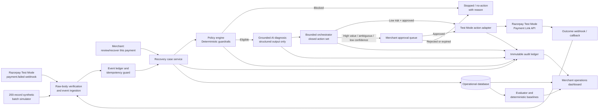
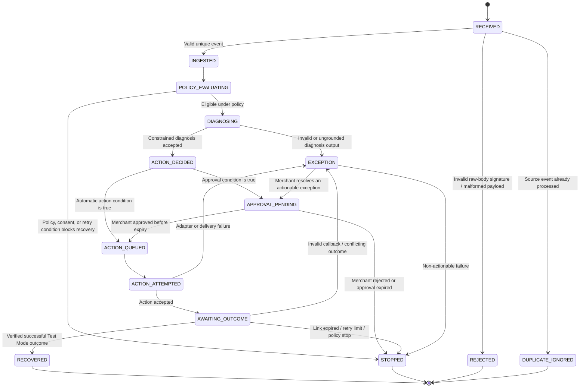
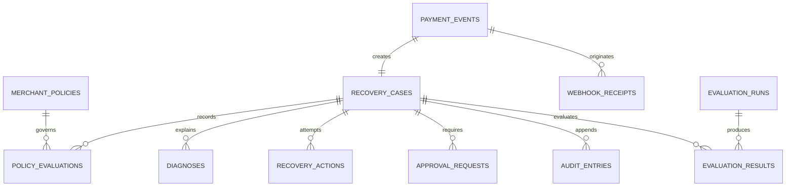

# RecoverFlow Architecture Specification

**Status:** Implementation blueprint  
**Scope:** Razorpay **Test Mode / sandbox only** for the buildathon demonstration

## 1. Architecture decision

RecoverFlow is a **hybrid-autonomy payment-recovery platform**. It does not wait for a merchant to ask about every failed payment. Instead, it receives a failed-payment event or a batch record, evaluates merchant policy, performs a grounded diagnosis, and can automatically execute only a low-risk, pre-approved action. Higher-risk, ambiguous, or high-value cases are paused in a merchant approval queue. A merchant can always initiate the same governed workflow manually through the exact entry point **“review/recover this payment.”**

> **Core principle:** AI may explain and recommend, but it never has authority to change a payment amount, customer identity, eligibility rule, recovery limit, or action outside the merchant-approved policy.

Razorpay documents webhooks as server-to-server asynchronous payment-flow notifications and specifically identifies `payment.failed` events as an input that can be analysed before notifying a customer. Razorpay supports separate Live and Test Mode webhook URLs; this platform is deliberately limited to **Test Mode**. [1] The platform must validate a webhook signature against the exact raw request body using HMAC-SHA256 before an event can affect recovery state. [2]

## 2. Product behaviour

| Trigger | What RecoverFlow does | Merchant control | Result |
|---|---|---|---|
| Razorpay Test Mode `payment.failed` webhook | Verifies the event, deduplicates it, applies policy, diagnoses the case, and determines the bounded next step | Merchant policy decides whether automatic action is permitted | Auto-action, approval queue, no-action, or exception |
| Synthetic batch replay | Imports a deterministic set of records through the same orchestration path | Merchant selects the configured policy version and evaluation run | Reproducible metrics, baseline comparison, and exception list |
| **“review/recover this payment”** | Merchant manually opens or initiates a case for review | Merchant initiation is recorded, but all guardrails still apply | A policy-constrained action or a documented no-action decision |
| Payment Link outcome / Razorpay webhook | Verifies signature, applies idempotent outcome handling, and finalises the case | No action can be repeated after a terminal outcome | Recovered, failed, expired, stopped, or exception |

### 2.1 Hybrid-autonomy decision matrix

| Situation | Required conditions | Platform behaviour |
|---|---|---|
| **Automatic action** | Failure type is eligible; consent is valid; amount is at or below the merchant’s auto-action threshold; diagnosis confidence meets the policy minimum; retry count is below limit; no risk or ambiguity flag exists | Execute one policy-approved bounded action and create an audit event |
| **Merchant approval required** | Amount exceeds auto-action threshold; confidence is low; diagnosis is ambiguous; action has an escalation level; or policy requires a human review | Create an approval task with evidence, recommended action, alternatives, and a strict expiry |
| **No action / stopped** | Missing consent; unsupported failure type; retry or contact limit reached; payment already resolved; policy denial; cooldown active; or abuse/risk flag | Record the stopping reason; do not contact the customer or create a link |
| **Manual recovery** | Merchant chooses **“review/recover this payment”** | Run the same policy, safety, and approval checks; manual initiation cannot bypass invariants | Action is executed only if allowed, otherwise the case is paused or stopped |

The recommended initial implementation has three automatic actions: a **simulated retry**, a **Razorpay Test Mode Payment Link fallback**, and a **policy-approved reminder**. The action set is closed: `NO_ACTION`, `SIMULATED_RETRY`, `PAYMENT_LINK_FALLBACK`, `REMINDER`, and `HUMAN_ESCALATION`. No AI-generated action name, raw API instruction, altered amount, or altered customer record is executable.

## 3. High-level design (HLD)



### 3.1 Core logical components

| Component | Responsibility | Must not do |
|---|---|---|
| **Event ingestion service** | Accept raw webhook payloads and batch records; verify, normalize, and deduplicate before creating a case | Trust an unsigned, malformed, or duplicate event |
| **Recovery case service** | Own the recovery lifecycle, immutable snapshots, and terminal-state transitions | Alter historical event facts or overwrite audit history |
| **Policy engine** | Determine eligibility, thresholds, consent, retry limits, escalation, cooldown, and stopping rules deterministically | Delegate mandatory constraints to the AI model |
| **Grounded diagnosis service** | Convert case evidence into a constrained cause, confidence, explanation, and allowed-action recommendation | Invent missing facts, change policy, or issue free-form API commands |
| **Bounded orchestrator** | Choose one action from the allowed set after policy validation and decide automation versus approval | Call a payment API before guardrails pass |
| **Razorpay Test Mode adapter** | Create, fetch, cancel, and reconcile Test Mode Payment Links; validate supported outcomes | Run against Live Mode or expose credentials to the client |
| **Approval service** | Present merchant review tasks and record approve/reject/expire decisions | Let an expired approval execute later |
| **Audit ledger** | Append immutable, hash-linked operational facts and decisions | Mutate or delete prior audit records through application features |
| **Evaluation service** | Run batch replay, baselines, held-out metrics, and deliberate failure scenarios | Count a non-verified action as recovered revenue |
| **Merchant dashboard** | Surface queue state, metrics, policies, case detail, approvals, and Test Mode labels | Hide exceptions, policy failures, or sandbox status |

## 4. Deployment and event-handling approach

For the buildathon, the platform is a full-stack web application with an authenticated merchant dashboard, database-backed state, and a server endpoint for external webhooks. Incoming webhooks are event-triggered and use deterministic logic for raw-body validation, deduplication, and state transitions. The platform therefore does not need a continuously polling worker.

Razorpay describes webhooks as the primary method for asynchronous automation and notes that they are delivered in near real time. [1] The webhook endpoint must be configured in the merchant’s Razorpay **Test Mode** dashboard and receive only HTTPS traffic. The platform does not use a browser redirect as a substitute for server-side webhook confirmation, because Razorpay distinguishes callbacks from webhooks. [1]

## 5. Low-level design (LLD)

### 5.1 Recovery case state machine



### 5.2 State invariants

| Invariant | Enforcement point |
|---|---|
| `amountSnapshot` is copied from the verified source event and never updated by AI, UI, policy, or action execution | Database schema, action command validation, and tests |
| `customerIdentitySnapshot` is copied from the verified source event and never updated after ingestion | Database schema, action command validation, and tests |
| Policy version is immutable once a decision has been made | Policy-decision record holds a policy snapshot and version |
| Every external event is processed at most once | Unique source-event identifier plus idempotency record and terminal outcome checks |
| Every external action has an idempotency key | Action table stores a deterministic key derived from case, action type, and attempt number |
| An action is executable only after policy and approval checks | Orchestrator command validator; the adapter accepts only validated command objects |
| “Recovered” requires verified Test Mode outcome evidence | Outcome handler requires signature validation and compatible state transition |
| Every state transition appends an audit entry | Transactional application service; no UI path updates case state directly |

### 5.3 Data model

| Table | Essential fields | Purpose |
|---|---|---|
| `merchant_policies` | `id`, `merchantId`, `version`, eligible failure types, `autoActionAmountCap`, `maxRetries`, consent rule, confidence threshold, escalation config, stopping rules, `isActive` | Versioned merchant recovery policy |
| `payment_events` | `id`, `merchantId`, `sourceEventId`, event type, raw payload digest, verified timestamp, payment id, amount snapshot, customer identity snapshot, failure data | Normalized, deduplicated external and simulated event record |
| `recovery_cases` | `id`, `merchantId`, `paymentEventId`, immutable amount and customer snapshots, policy version, state, source, risk flags, terminal reason | Lifecycle aggregate for a recoverable payment |
| `policy_evaluations` | `id`, `caseId`, policy snapshot, eligibility result, matched rules, auto-action decision, stop reason | Deterministic decision evidence |
| `diagnoses` | `id`, `caseId`, allowed cause, confidence, evidence JSON, explanation, recommended allowed action, model metadata | Structured grounded diagnosis result |
| `recovery_actions` | `id`, `caseId`, type, idempotency key, status, action payload snapshot, attempt number, provider reference, expiry, result | Bounded recovery-action history |
| `approval_requests` | `id`, `caseId`, recommended action, status, rationale, requested at, expires at, decided by, decision reason | Human-in-the-loop control |
| `webhook_receipts` | `id`, source event id, raw payload digest, signature status, received timestamp, processing state | Authentication and duplicate-event evidence |
| `audit_entries` | `id`, `caseId`, sequence, event type, actor, payload digest, previous hash, entry hash, timestamp | Append-only chain of operational history |
| `evaluation_runs` | `id`, policy version, dataset version, seed, run type, started and completed timestamps | Reproducible simulator and evaluator context |
| `evaluation_results` | `id`, `runId`, case id, baseline, outcome, recovered amount, false-positive cost, exception class, test split | Per-case analysis and metric calculation |

### 5.4 Database relations



### 5.5 API contracts

All UI-facing operations use authenticated typed RPC procedures. The webhook endpoint is a separate raw-body HTTP route so that signature verification occurs before JSON parsing or transformation.

| Endpoint / procedure | Input | Core behaviour | Guardrail |
|---|---|---|---|
| `POST /api/webhooks/razorpay` | Raw body plus `X-Razorpay-Signature` | Verify HMAC, persist receipt, deduplicate, normalize, enqueue orchestration | Reject invalid signature; never parse before verification |
| `recoveryCases.list` | Filter, cursor, queue state | Return queue, case summary, and visibility-safe metrics | Authenticated merchant scope |
| `recoveryCases.get` | Case ID | Return immutable snapshots, decision timeline, actions, approvals, and audit entries | Never return secrets or raw credentials |
| `recoveryCases.manualReviewRecover` | Existing payment event/case identity | Initiate merchant workflow under exact UI label **“review/recover this payment”** | Same policy and invariant checks as webhook path |
| `approvals.decide` | Approval ID, `approve` or `reject`, optional reason | Record the merchant decision and continue or stop the case | Expiry and merchant ownership are verified |
| `policies.get` / `policies.update` | Policy form fields | Retrieve or create a new versioned policy | Existing case policy snapshots do not change |
| `evaluation.run` | Dataset version, seed, policy version | Execute batch replay plus deterministic baselines | Test split cannot be reclassified during a run |
| `dashboard.overview` | Time window | Return queue state, revenue metrics, precision, cost, exceptions, baseline comparison | Clearly identifies Test Mode / sandbox results |

### 5.6 Grounded diagnosis contract

The diagnosis service returns JSON validated against a strict schema. It receives only the case snapshot, policy-approved failure taxonomy, and action vocabulary. It does not receive any function that can change payment values or call Razorpay directly.

```ts
type DiagnosisOutput = {
  failureCause: "TEMPORARY_DECLINE" | "CUSTOMER_FRICTION" | "INSUFFICIENT_CONTEXT" | "UNSUPPORTED";
  confidence: number; // 0 to 1
  evidence: Array<{ field: string; observedValue: string; relevance: string }>;
  explanation: string;
  recommendedAction: "NO_ACTION" | "SIMULATED_RETRY" | "PAYMENT_LINK_FALLBACK" | "REMINDER" | "HUMAN_ESCALATION";
  uncertaintyReason?: string;
};
```

The policy engine independently validates the recommendation against the current case, policy snapshot, consent status, action limits, and approval requirements. Any invalid enum, missing evidence, low confidence, or contradiction produces an exception or approval request; it never produces an automatic payment action.

### 5.7 Razorpay Test Mode adapter

The adapter is the only module allowed to integrate with Razorpay. It receives a validated command with the immutable amount and customer snapshot. Payment Link commands use the pre-approved amount, merchant-provided expiry, and deterministic reference and idempotency metadata. The UI marks every related component with **“Razorpay Test Mode — Sandbox: no real money is moved.”**

Razorpay documents that Payment Links APIs can create, update, cancel, fetch, and resend links. It also describes storing the Payment Link identifier and performing server-side signature validation for completion data. [3] The adapter will validate callback and webhook information server-side and write a new immutable outcome event rather than treating a browser redirect as authoritative.

## 6. Evaluation and demonstration design

### 6.1 Synthetic dataset

The simulator produces 200 deterministic synthetic failed-payment records from a recorded seed. Each record contains an event identity, payment identity, amount, failure type, timestamp, contact and consent status, retry history, policy context, expected latent recoverability, and a simulated outcome model. The data is split once into 160 development records and 40 held-out records. The split and seed are stored in `evaluation_runs`.

### 6.2 Baselines and metrics

| Comparator | Definition | Why it matters |
|---|---|---|
| No-action baseline | Stops every case | Establishes revenue that would otherwise remain unrecovered |
| Single-retry baseline | Retries every policy-eligible case once | Tests whether diagnosis and targeting add value |
| Payment-Link baseline | Sends a link to every consented eligible case | Exposes over-contacting and false-positive cost |
| RecoverFlow policy agent | Applies policy, diagnosis, hybrid autonomy, and stops | Demonstrates value and safety trade-off |

| Metric | Formula | Required display |
|---|---|---|
| Recovered revenue | Sum of verified recovered Test Mode amounts | Total and baseline delta |
| Recovery rate | Recovered eligible amount / eligible at-risk amount | Overall and held-out |
| Action precision | Successful recovery actions / executed recovery actions | Overall and by action type |
| False-positive cost | Cost assigned to unnecessary contact or action | Total and rate |
| Exception rate | Exceptions / all processed cases | Breakdown by cause |
| Stopping-rule compliance | Cases stopped correctly / cases requiring stop | Explicit proof of bounded autonomy |
| Approval rate | Cases requiring approval / eligible cases | Highlights merchant workload |

### 6.3 Deliberate failure scenarios

| Scenario | Expected safe behaviour |
|---|---|
| Duplicate `payment.failed` event | The second receipt is recorded as duplicate; no second case or action is created |
| Invalid webhook signature | Event is rejected before normalization; no case is opened |
| Payment above auto-action threshold | An approval request is created; no link is generated automatically |
| Low-confidence diagnosis | The platform routes the case to approval or no-action according to policy |
| Missing consent | The case is stopped and the reason is recorded |
| Expired Payment Link | The outcome is stored once, the case stops, and no new link is created unless separately approved |
| Conflicting terminal webhook outcome | The case becomes an exception; no amount is counted as recovered |

## 7. Test strategy

| Test layer | Coverage |
|---|---|
| Unit tests | Policy eligibility, threshold checks, consent, retry and stop rules, diagnosis schema validation, action selection, immutability checks, idempotency-key generation, state transition guardrails, metric formulas |
| Integration tests | Raw-body HMAC validation, webhook receipt deduplication, payment-link command construction, callback/outcome reconciliation, approval expiry, audit append chain |
| UI tests | Policy control behaviour, visible Test Mode labels, queue filtering, exact **“review/recover this payment”** label, approval confirmation, exception timeline |
| Evaluation tests | Fixed simulator seed, fixed 160/40 split, baseline reproducibility, known expected metric snapshot, deliberate failure outcomes |
| Manual demo checklist | Fresh database setup, batch replay, automatic low-risk path, high-value approval path, duplicate webhook, invalid signature, link outcome, audit inspection |

## 8. Phased implementation roadmap

| Phase | Deliverable | Exit condition |
|---|---|---|
| 1 | Documentation, domain model, and policy definitions | This architecture is in the repository and all invariants are unambiguous |
| 2 | Database schema, data-access helpers, policy engine, and audit foundation | Policy decision and append-only audit tests pass |
| 3 | Ingestion, deduplication, orchestration, approval queue, and local simulator | One case can reach each non-terminal state safely |
| 4 | Razorpay Test Mode adapter and secure webhook/callback verification | Payment Link command and outcome flow are idempotent and visibly sandbox-only |
| 5 | Merchant dashboard and **“review/recover this payment”** path | Merchant can inspect, approve, stop, and manually initiate governed recovery |
| 6 | 200-record replay, held-out evaluation, baselines, failure suite, and metrics dashboard | Results are reproducible and exceptions are visible |
| 7 | Demo polish, repository documentation, visual verification, and final checkpoint | Fresh-clone instructions, test suite, and five-minute demo flow succeed |

## References

[1]: https://razorpay.com/docs/webhooks/?preferred-country=US "Razorpay Docs — About Webhooks"

[2]: https://razorpay.com/docs/webhooks/validate-test/?preferred-country=US "Razorpay Docs — Validate and Test Webhooks"

[3]: https://razorpay.com/docs/payments/payment-links/apis/?preferred-country=US "Razorpay Docs — Payment Links APIs"
