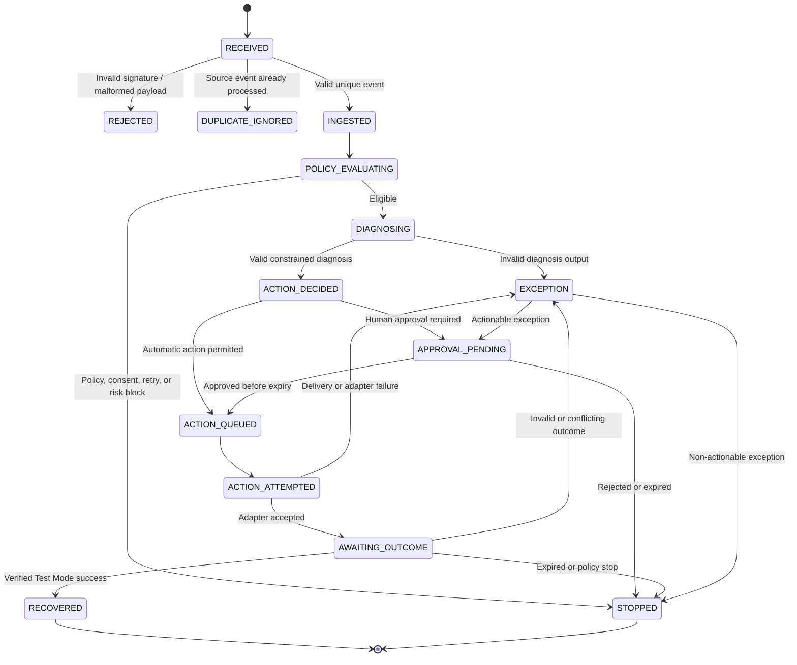

# RecoverFlow — Pitch-Video HLD

## One-line architecture pitch

RecoverFlow is a **hybrid-autonomy payment-recovery control plane**: it receives failed-payment signals from Razorpay Test Mode, applies deterministic merchant policy, uses grounded AI only for diagnosis and recommendation, and executes a closed set of safe recovery actions while recording every decision in an immutable audit trail.

> **AI can explain and recommend. It cannot change payment amount, customer identity, merchant policy limits, or execute an unapproved action.**

## 1. The problem

A failed payment is not simply a transaction error. It is an operational decision: should the merchant retry, send a payment link, contact the customer, escalate to a human, or stop? A naive automation system can create financial, compliance, and customer-experience risk by retrying too often, changing payment facts, contacting the wrong customer, or treating an unverified callback as successful recovery.

RecoverFlow addresses this by separating **understanding** from **authority**. AI helps interpret failure evidence, but deterministic merchant-owned policies and an approval boundary control what can actually happen.

## 2. High-level system architecture

```mermaid
flowchart LR
    RP[Razorpay Test Mode\npayment.failed webhook] --> ING[Webhook ingestion\nraw-body HMAC verification]
    B[200-record synthetic\nbatch replay] --> ING
    M[Merchant action:\nreview/recover this payment] --> CASE[Recovery case service]
    ING --> IDEMP[Event ledger\nsource identity + deduplication]
    IDEMP --> CASE
    CASE --> POLICY[Deterministic policy engine\nconsent · limits · retries · risk]
    POLICY -->|Blocked| STOP[Stopped / no action\nreason recorded]
    POLICY -->|Eligible| AI[Grounded diagnosis\nstrict structured output]
    AI --> ORCH[Bounded orchestrator\nclosed action vocabulary]
    ORCH -->|Low risk + policy-approved| ADAPTER[Razorpay Test Mode\naction adapter]
    ORCH -->|High value / ambiguous| APPROVAL[Merchant approval queue]
    APPROVAL -->|Approved before expiry| ADAPTER
    APPROVAL -->|Rejected / expired| STOP
    ADAPTER --> LINK[Razorpay Test Mode\nPayment Link API]
    LINK --> OUTCOME[Signed outcome webhook\nor callback]
    OUTCOME --> ING
    CASE --> AUDIT[Immutable hash-linked\naudit ledger]
    POLICY --> AUDIT
    AI --> AUDIT
    ORCH --> AUDIT
    ADAPTER --> AUDIT
    CASE --> DB[(Supabase Postgres\noperational control plane)]
    AUDIT --> DB
    DB --> DASH[Authenticated merchant\noperations dashboard]
    DB --> EVAL[Evaluator + deterministic\nbaseline metrics]
    EVAL --> DASH
```

The architecture has five important boundaries. **Event ingestion** authenticates and deduplicates external signals. **The recovery case service** owns lifecycle state and immutable payment snapshots. **The policy engine** makes deterministic eligibility decisions. **The grounded diagnosis service** produces constrained explanations and recommendations. **The bounded orchestrator and action adapter** ensure only an approved action can reach Razorpay Test Mode.

## 3. End-to-end recovery flow

First, RecoverFlow receives a Razorpay Test Mode `payment.failed` event, a synthetic batch record, or a merchant-initiated **“review/recover this payment”** request. For an external webhook, the server preserves the exact raw request body and validates the Razorpay signature using HMAC-SHA256 before parsing or mutating any recovery state.

Next, the event ledger applies idempotency using the source-event identity and payload digest. Duplicate events become visible as duplicate evidence but cannot create a second recovery action. A valid unique event creates a recovery case containing immutable snapshots of the payment amount and customer identity.

The policy engine then evaluates merchant-owned rules: eligible failure type, customer consent, maximum amount for automatic recovery, retry count, cooldown, contact limits, risk flags, confidence threshold, and escalation requirements. If a rule blocks recovery, the case is stopped with an explicit reason. No customer contact, payment link, or retry is created.

For eligible cases, the diagnosis service receives only the case evidence, the approved failure taxonomy, and the closed action vocabulary. It returns structured JSON containing a permitted failure cause, confidence, evidence references, explanation, and one allowed recommendation. It cannot call Razorpay and cannot modify the payment or policy.

The bounded orchestrator makes the final operational decision. Low-risk cases may proceed automatically when all policy conditions are satisfied. High-value, low-confidence, ambiguous, or escalation-required cases are placed in the merchant approval queue. A merchant approval is valid only before its expiry time; rejection or expiry stops the case.

If approved, the adapter may perform one of the bounded actions: a simulated retry, a Razorpay Test Mode Payment Link fallback, a policy-approved reminder, or human escalation. Razorpay credentials remain server-side. A recovery is counted only after a compatible, signed Test Mode outcome is received. Expired, conflicting, invalid, or duplicate outcomes are recorded safely without corrupting the case.

## 4. Recovery state machine

The state machine prevents accidental double execution and makes every terminal result explainable. Each transition appends an audit event, and each external action carries a deterministic idempotency key.

## 5. Data and persistence design

Supabase Postgres is the durable control plane. The core records are payment events, recovery cases, versioned merchant policies, policy evaluations, diagnoses, recovery actions, approval requests, webhook receipts, immutable audit entries, evaluation runs, and evaluation results.

| Data area | Design decision | Pitch significance |
|---|---|---|
| Payment facts | Amount and customer identity are stored as immutable source snapshots | AI and UI cannot silently alter financial or identity data |
| Policy | Versioned merchant policy is snapshotted into each decision | Historical decisions remain explainable after policy updates |
| Actions | Closed action type, attempt number, expiry, provider reference, and idempotency key | Retrying an API request cannot create uncontrolled duplicates |
| Webhooks | Raw-body digest, signature status, source ID, and processing state | External events are authenticated and auditable |
| Audit | Append-only, sequence-based, hash-linked entries | The merchant can inspect who decided what and why |
| Evaluation | Dataset version, seed, held-out split, baseline, outcome, and recovered amount | Buildathon results are reproducible rather than anecdotal |

Row-level security protects merchant data, while the server-side service-role path is reserved for trusted webhook persistence. The browser receives only authenticated, visibility-safe data through typed tRPC procedures. No credential or service-role key is sent to the client.

## 6. Security and AI safety model

RecoverFlow uses defense in depth. Razorpay webhooks must pass raw-body signature verification. Supabase Auth protects the admin dashboard, and server procedures require the administrator role. Database policies restrict access to the authorized merchant scope. The action adapter accepts only validated command objects produced after policy and approval checks.

The most important safety property is **authority separation**. The model is not an autonomous payment operator. It is a bounded reasoning component. It cannot change amount, identity, consent, merchant limits, policy version, or the action vocabulary. The orchestrator, not the model, decides whether automation is allowed. The adapter, not the model, communicates with Razorpay.

## 7. Dashboard and evaluation story

The authenticated dashboard gives the merchant a recovery queue, policy view, approval queue, selected-case evidence, review history, immutable audit trail, webhook receipt history, and evaluation metrics. It clearly labels synthetic data and Razorpay Test Mode results. The merchant can filter by decision class, search by case ID or customer email, narrow by date and amount, export case evidence as CSV, and perform guarded bulk approval or rejection only for pending cases.

The synthetic 200-record replay passes through the same orchestration path as webhook cases. RecoverFlow compares its governed recovery results with deterministic baselines, reports recovery rate and recovered revenue, and surfaces exceptions and false-positive cost. This demonstrates not only that the system can recover payments, but that it can measure whether recovery is safe and worthwhile.

## 8. Deployment architecture

The frontend is a React and Vite application. The backend is an Express and tRPC server exposed through a Vercel serverless function. Supabase provides Auth and Postgres persistence. Razorpay Test Mode provides the payment-link and signed-webhook boundary. Vercel serves the public application and routes `/api/trpc/*` and `/api/webhooks/razorpay` to the serverless backend.

The system does not need a continuously running compute engine for this buildathon. Webhooks are event-triggered, the dashboard is request-driven, and durable state is stored in Supabase. Vercel Functions plus Supabase are sufficient for the demonstrated workload while preserving a clear path to a queue or worker service if future production volume requires asynchronous fan-out.

## 9. Suggested 90-second spoken pitch

> RecoverFlow is a hybrid-autonomy payment-recovery control plane for failed Razorpay payments. The key design decision is that AI does not get payment authority. It only explains the failure and recommends an action inside a merchant-approved vocabulary.
>
> A failed-payment webhook enters through a raw-body HMAC verification boundary. RecoverFlow deduplicates the source event, creates an immutable recovery case, and snapshots the original payment amount and customer identity. A deterministic policy engine then checks consent, amount caps, retry limits, cooldowns, risk flags, and escalation rules.
>
> If the case is not eligible, RecoverFlow stops it with a visible reason. If it is eligible, a grounded diagnosis produces structured evidence, confidence, and a constrained recommendation. Low-risk cases can use a bounded Test Mode action automatically. High-value or ambiguous cases go to a merchant approval queue, where approval must happen before expiry.
>
> Every action is idempotent and every state transition is recorded in a hash-linked audit ledger. A payment is counted as recovered only after a verified Razorpay Test Mode outcome, never merely because a link was created. Supabase Postgres stores the durable control-plane state, Supabase Auth protects the administrator dashboard, and Vercel hosts the serverless API and frontend.
>
> The result is not just an AI script that retries payments. It is an explainable, policy-controlled recovery system that demonstrates revenue recovery while preserving merchant permission, customer identity, financial immutability, and auditability.

## 10. Closing line

> **RecoverFlow turns failed payments into governed recovery decisions: explainable by AI, authorized by policy, executed within strict bounds, and proven by an immutable trail.**

## Presenter emphasis

When presenting, emphasize three differentiators: **hybrid autonomy instead of blind automation**, **AI bounded by deterministic merchant policy**, and **verified outcomes plus immutable evidence instead of optimistic success metrics**. Keep repeating that the demonstration is explicitly **Razorpay Test Mode / sandbox**, with credentials server-side and no live-payment risk.

